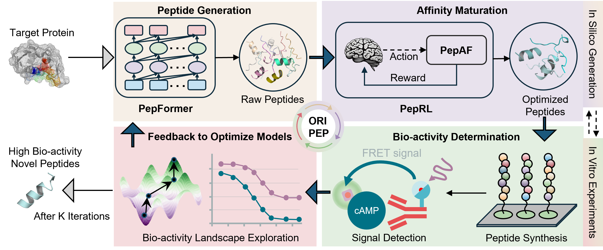

# ORIPEP

ORIPEP is a toolkit for de novo peptide generation, mutation optimization, and protein-peptide affinity prediction. This project includes multiple modules for different tasks.



## Installation and Setup

1. **Hardware requirements**:
   This project requires only a standard computer with enough RAM and a NVIDIA GPU to support operations. We ran the demo using the following specs:
   - CPU: 10 cores, 2.5 GHz/core
   - RAM: 40GB
   - GPU: NVIDIA TESLA P40, V100, A100
   - CUDA: 11.0

2. **System requirements**:
   This tool is supported for Linux. The tool has been tested on the following system:

   - CentOS Linux release 8.2.2.2004

3. **Clone the Repository**:
   ```bash
   git clone https://github.com/yourusername/ORIPEP.git
   cd ORIPEP
   ```

4. **Install Required Packages**:
   The basic environment requirements are:
   - Python: 3.10
   - CUDA: 11.0

   Use the following command to install the necessary packages as specified in the `requirements.txt` file:

   ```bash
   conda create -n ORIPEP python==3.10
   conda activate ORIPEP
   pip install -r requirements.txt
   ```

5. **Download Model Weights**:

   Download the `model_weights.zip` file and extract it to the `ORIPEP/model_weights` directory. The model_weights.zip is available on Zenodo: <https://doi.org/10.5281/zenodo.14500068>

   After extraction, the `ORIPEP/model_weights` directory should contain the following:

   ```plaintext
   ORIPEP/model_weights/
   ├── ESM-2/
   ├── ESM-Pep/
   ├── PepAF/
   └── PepGPT/
   ```
   
6. **Download Receptor Data**:

   Download the `receptor_data.zip` file and extract it to the `ORIPEP/PepAF` directory, specifically to `ORIPEP/PepAF/receptor_data`. The receptor_data.zip is available on Zenodo: <https://doi.org/10.5281/zenodo.14500068>

   After extraction, the `ORIPEP/PepAF/receptor_data` directory should contain the following:

   ```plaintext
   ORIPEP/PepAF/receptor_data/
   ├── coordinates.json
   ├── mod_rec_seq.json
   ├── rec_interface.json
   ├── supported_receptor_pdbid.txt
   └── esm/
   ```

---

## Quick Start
   To quickly get started with ORIPEP, you can use the provided automation script. Follow these steps:

1. **Run the Automation Script**:
   After setting up the environment and downloading the necessary files, you can run the automation script to start an example task easily.

      ```bash
      python run_oripep.py
      ```
   This will present you with a menu to select from the following options:
   ```
   Welcome to the ORIPEP automation script!

   Please choose an option:
   1. Run PepGPT generation
   2. Run PepRL optimization
   3. Run single prediction in PepAF
   4. Run batch prediction in PepAF
   5. Exit
   Enter your choice (1-5):
   ```

   1. **Run PepGPT generation**
   - Select option 1 will initiate the PepGPT model to generate diverse peptide sequences for a specific target protein. This model leverages language modeling techniques to produce peptide sequences with potential biological activity. If you want to specify parameters such as the input protein sequence, please refer to Further instructions 1.
   ```
   Enter your choice (1-5): 1
   Running command: cd PepGPT && python sample.py
   INFO - Starting peptide generation process...
   INFO - Initializing PeptideGenerator...
   INFO - Generating valid peptide sequences...
   INFO - Generating text with prompt: <aligned><protein>MKEQDSEEELIEAFKVFDRDGNGLISAAELRHVMTNLGEKLTDDEVDEMIREADIDGDGHINYEEFVRMMVSK<peptide>
   INFO - Generating sequences...
   INFO - Total valid peptides generated: 63
   INFO - Generated Peptide Sequences: ['S P A K R K Q A T G H D K E V I Q R A Y R R Y L I L V K K N K R H K V F E P K T E R L H H K', 'Q E E V S A I Q R A Y R R Y L K Q K V K K', 'K R K Q E E V S A I V I Q R A Y R R Y L L K Q K V K K'...]
   ```

   2. **Run PepRL optimization**
   - Select option 2 will start the Reinforcement Learning (RL) optimization process. This process will optimize the given peptide sequence targeting a specific protein (pdb id) to search better mutated sequences with higher affinity. If you want to specify parameters such as the target protein and the initial peptide sequence, please refer to Further instructions 2.
   ```
   Enter your choice (1-5): 2
   Running command: cd PepRL && sh run.sh
   Target PDB: 7lll_R, Start sequence: QDEEGLLLMQSLEMS
   The current date and time is ...
   ################## model loaded on cuda #####################
   ######### 1-th Play ###########
   Mutated seq QDEEGLLLFQSLEMS
   Mutated seq QDEEGLCLFQSLEMS
   Mutated seq QWEEGLCLFQSLEMS
   Mutated seq QWEEGLCLFQHLEMS
   Mutated seq QWQEGLCLFQHLEMS
   ######### 2-th Play ###########
   Mutated seq QLEEGLCLFQHLEMS
   ...
   Output directory: 
   ./results/7lll_R/QDEEGLLLMQSLEMS
   ```

   3. **Run single prediction in PepAF**
   - Selection option 3 allows you to perform a binding affinity for a given protein and a peptide. If you want to specify parameters such as the target protein and the peptide sequence, please refer to Further instructions 3.
   ```
   Enter your choice (1-5): 3
   Running command: cd PepAF && python predict.py --task single
   Starting prediction for protein: 3dab_G, peptide: TSFAEYWNLLSP
   Dataset created.
   Models loaded successfully.
   Predicted binding affinity between 3dab_G and TSFAEYWNLLSP: 7.570078659057617
   ```

   4. **Run batch prediction in PepAF**
   - Selection option 4 allows you to conduct batch predictions for multiple peptide sequences. This is particularly useful when you need to asess a large number of peptide sequences simultaneously. If you want to specify parameters such as the target protein and the peptide sequences, please refer to Further instructions 4.
   ```
   Enter your choice (1-5): 4
   Running command: cd PepAF/utils/preprocess && sh start.sh
   Starting the process...
   Creating DataFrame...
   DataFrame created successfully.
   Adding SMILES data...
   Converting peptide TSV to JSON...
   Converting peptides to FASTA format...
   Creating directory for IDs...
   Changing directory to ../iupred...
   Calculating matrix...
   Merging results...
   Merging completed successfully.
   Extracting peptide embeddings...
   Extracting protein embeddings...
   Process completed successfully.
   Running command: cd PepAF && python predict.py --task batch
   Results have been saved in PepAF/output/batch.tsv
   ```
   5. **Exit:**
   - Choosing this option will exit the script and terminate the current session.
   ```
   Enter your choice (1-5): 5
   Exiting the script.
   ```
   Simply enter the corresponding number to execute your desired task.

---

## Further Instructions
### 1. Generate New Peptides Using PepGPT

Navigate to the `PepGPT` directory and run the example code:
```bash
cd ORIPEP/PepGPT
python sample.py
```


#### Key Parameter Explanations:
- `--prompt`: The prompt sequence for generating peptides, with a default value of `'MKEQDSEEELIEAFKVFDRDGNGLISAAELRHVMTNLGEKLTDDEVDEMIREADIDGDGHINYEEFVRMMVSK'`.
- `--max_length`: The maximum length of generated sequences, with a default value of `512`.
- `--num_sequences`: The number of sequences to generate, with a default value of `100`. Note that the repeated sequences will only diplay one time.

### 2. Optimize Peptide Mutations Using PepRL and PepAF

Navigate to the `PepRL` directory and run the optimization script:
```bash
cd ORIPEP/PepRL
sh run.sh
```

#### Key Parameter Explanations:
- `PLAYOUT_NUM=20`: The number of rounds for each game.
- `NITER=100`: The number of optimization iterations.
- `WORKDIR='./'`: The working directory.
- `PDBID='7lll_R'`: The PDB ID of the target protein.
- `SEQ='QDEEGLLLMQSLEMS'`: The peptide sequence to be optimized.
- `OUTPUT_DIR="./results/${PDBID}/${SEQ}"`: The directory for output results.

A list of supported PDB IDs can be found in `ORIPEP/PepAF/receptor_data/supported_receptor_pdbid.txt`.

### 3. Predict Protein-Peptide Affinity Using PepAF

A list of supported PDB IDs can be found in `ORIPEP/PepAF/receptor_data/supported_receptor_pdbid.txt`.

Since PepAF requires various features for prediction, we support two approaches to use PepAF:

#### 3.1 Single Protein-Peptide Prediction

Use the built-in feature extraction by specifying the target PDB ID and peptide sequence in `predict.py`:
```bash
cd ORIPEP/PepAF
python predict.py --task single
```

#### 3.2 Batch Calculation for Single Protein and Multiple Peptides

First, navigate to the feature extraction directory and run:
```bash
cd ORIPEP/PepAF/utils/preprocess
sh start.sh
```
You can modify the `target.txt` and `peptide.txt` files to set the target and peptide sequences.

Then, return to the `PepAF` directory and run batch prediction:
```bash
cd ORIPEP/PepAF
python predict.py --task batch
```